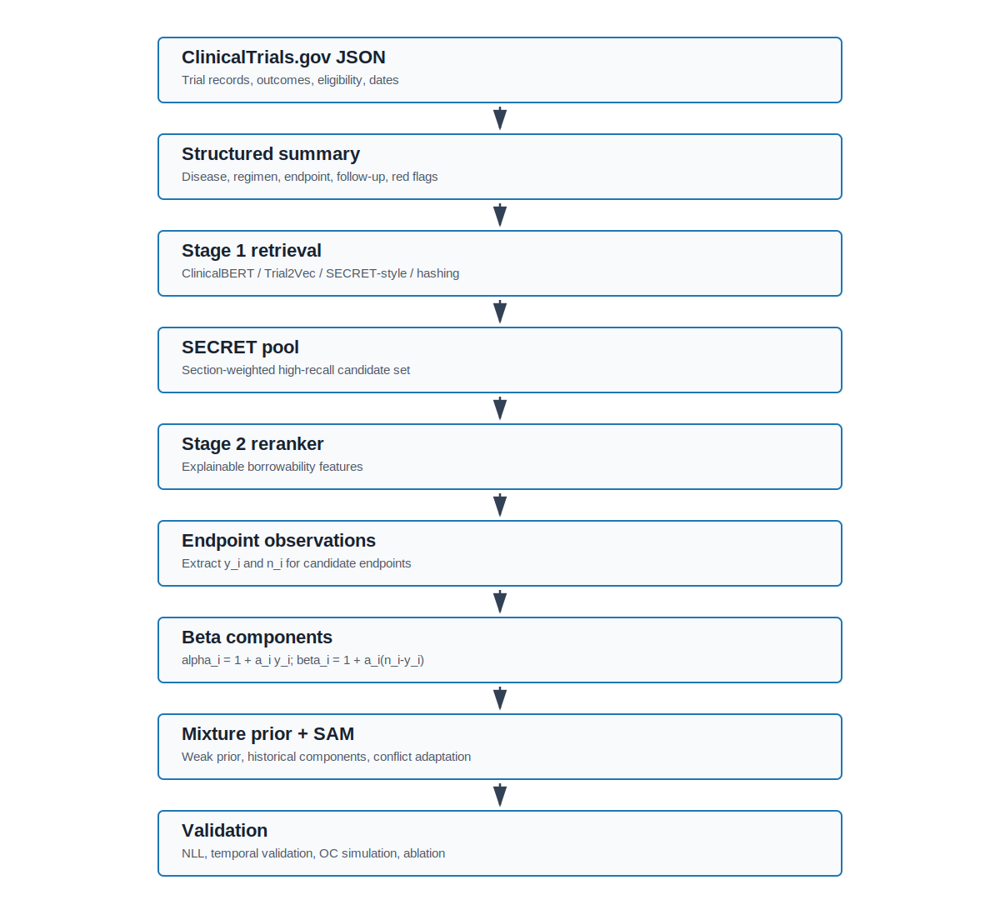

# Oncology Trial Similarity for Bayesian Historical Borrowing

This repository provides a reproducible methodology prototype and retrospective predictive calibration evidence package for oncology trial similarity and Bayesian historical borrowing.

The goal is not generic trial text retrieval. The goal is to identify historical ClinicalTrials.gov trials that are sufficiently comparable to serve as candidate evidence for Bayesian mixture-prior borrowing, while making disease, regimen, endpoint, follow-up, eligibility, result usability, information size, and red flags explicit.

## Why Similarity Is Not Borrowability

Textual or title-level similarity is not enough for historical borrowing. A historical trial may have similar wording but differ in endpoint definition, treatment line, follow-up duration, outcome availability, or red flags that make it unsuitable as prior evidence.

This project separates three ideas:

- **Retrievability:** can a historical trial be surfaced as a plausible candidate?
- **Clinical/statistical comparability:** does the candidate match the new trial along borrowing-relevant dimensions?
- **Borrowing behavior:** how much mixture weight and effective sample-size discount should the candidate receive?

All current validation is performed without expert borrowability labels. Results should be interpreted as retrospective predictive calibration and simulation evidence, not as clinical validation or regulatory qualification.

## Pipeline Diagram



## Pipeline Overview

1. **ClinicalTrials.gov JSON parsing**
   - Parse trial records, results tables, eligibility criteria, endpoints, interventions, and date metadata.
2. **Structured trial summary**
   - Build normalized oncology summaries with disease, population, regimen, endpoint, follow-up, eligibility, results availability, and red flags.
3. **Stage 1 retrieval**
   - Retrieve high-recall candidate trials using hashing, ClinicalBERT, Trial2Vec-style, or SECRET-style section retrieval.
4. **SECRET pool**
   - Use fixed section scores to form a more borrowability-aware candidate pool.
5. **Stage 2 explainable reranking**
   - Score candidate pairs using borrowing-relevant features rather than title similarity alone.
6. **Endpoint observation extraction**
   - Extract candidate endpoint observations `(y_i, n_i)` when result data are usable.
7. **Beta component construction**
   - Construct `alpha_i = 1 + a_i y_i` and `beta_i = 1 + a_i(n_i - y_i)`.
8. **Mixture prior and optional SAM adapter**
   - Combine a weak component with historical beta components and optionally downweight prior-data conflict.
9. **Retrospective validation**
   - Evaluate held-out beta-binomial NLL, true-date temporal NLL, simulation operating characteristics, paired retrieval benchmarks, baseline comparisons, and feature ablations.

## Key Statistical Definitions

For historical candidate `i`:

- `y_i`: observed response count or endpoint event count.
- `n_i`: denominator for the candidate endpoint observation.
- `a_i`: sample-size discount applied inside the beta component.
- `lambda_i`: mixture weight assigned to the candidate component.
- `lambda_0`: weak-prior mixture weight, defaulting to 0.2 in the current prototype.

The historical beta component is

```text
alpha_i = 1 + a_i y_i
beta_i  = 1 + a_i (n_i - y_i)
```

The two-head DeepSets model separates `lambda_i` and `a_i`: one head learns mixture allocation across candidates, while the other learns within-component information discounting.

## Main Scripts

| Script | Purpose |
|---|---|
| `docs/oncology_trial_similarity_pipeline.py` | Core trial parsing, indexing, retrieval, reranking, and structured summary pipeline. |
| `scripts/clinicaltrials_dates.py` | Extract true ClinicalTrials.gov date metadata and date precision labels. |
| `scripts/temporal_validation.py` | Shared date-based and rolling-origin temporal split utilities. |
| `scripts/run_oncology_retrospective_lambda_training.py` | Retrospective pseudo-query construction, lambda model training, and temporal validation modes. |
| `scripts/run_borrowing_operating_characteristics_simulation.py` | Formal simulation operating-characteristics study. |
| `scripts/run_paired_stage1_backend_benchmark.py` | Paired Stage 1 backend benchmark on common query IDs and candidate budgets. |
| `scripts/run_borrowing_baseline_comparison.py` | Head-to-head comparison of weak, rule, classical, SAM, and trained two-head borrowing priors. |
| `scripts/run_temporal_borrowing_validation.py` | True-date temporal borrowing NLL summaries. |
| `scripts/run_feature_ablation_sensitivity.py` | Feature group ablation and SECRET section-weight sensitivity. |
| `scripts/build_manuscript_evidence_package.py` | Build lightweight `results/` tables and figures from artifacts. |
| `scripts/run_no_expert_validation_suite.sh` | Reproducibility-oriented command skeleton for the no-expert validation suite. |

## Quick Start

Install Python dependencies:

```bash
python -m pip install -r requirements.txt
```

Build the manuscript evidence package from existing artifacts:

```bash
python scripts/build_manuscript_evidence_package.py
```

Run focused non-torch tests:

```bash
python -m unittest \
  tests/test_clinicaltrials_dates.py \
  tests/test_temporal_validation.py \
  tests/test_temporal_borrowing_validation.py \
  tests/test_borrowing_operating_characteristics_simulation.py \
  tests/test_paired_stage1_backend_benchmark.py \
  tests/test_borrowing_baseline_comparison.py \
  tests/test_feature_ablation_sensitivity.py
```

The full retrospective two-head model training path requires `torch`. If `torch` is unavailable, the repository still supports date extraction, baseline comparisons, paired backend benchmarking, simulation, feature ablation, and evidence-package generation.

## Artifact Guide

Large runtime artifacts are intentionally ignored by Git. The public, lightweight evidence package lives in `results/`.

| Directory | Role |
|---|---|
| `artifacts/` | Full local runtime outputs; ignored by Git. May contain large JSONL files and model artifacts. |
| `results/tables/` | Lightweight CSV and LaTeX-ready tables suitable for manuscript drafting. |
| `results/figures/` | Lightweight SVG figures for the manuscript and README. |
| `docs/` | Methods notes, reproducibility notes, data availability statement, and manuscript planning documents. |

## Current Result Highlights

Current lightweight results are generated from ORR pseudo-queries without expert borrowability labels.

- SECRET pool improved paired Stage 1 component-readiness over hashing by 0.0912 with a bootstrap CI of [0.0799, 0.1018].
- SECRET pool improved reranked endpoint-match score over hashing by 1.1047 with a bootstrap CI of [1.0600, 1.1503].
- In the borrowing baseline head-to-head table, `two_head_trained` achieved mean NLL 3.0181 versus rule mean NLL 3.1620.
- `rule_sam` achieved mean NLL 2.9721, highlighting the importance of prior-data conflict adaptation.
- True-date temporal NLL summaries show `two_head_trained` and `rule_sam` improvements across multiple date-based and rolling-origin subsets.
- Simulation operating-characteristics results cover exchangeable, optimistic conflict, pessimistic conflict, mixture conflict, and heterogeneous historical scenarios using 500 iterations and 400 deterministic template examples.

See `results/README.md` for the file-level guide.

## Limitations Without Expert Labels

This repository does not contain expert borrowability labels. It does not claim that the retrieved historical trials are clinically approved for borrowing, nor that the resulting priors are acceptable for regulatory submission.

Current evidence is limited to retrospective predictive calibration, internal temporal evaluation, simulation operating characteristics, and automated feature ablation. Clinical and statistical expert review remains necessary before using any historical trial as external evidence in a real oncology trial design.

Additional limitations include automated ClinicalTrials.gov extraction error, endpoint mapping error, primary focus on ORR examples, limited full retraining temporal validation in environments without `torch`, and no prospective operating trial validation.

## Reproducibility Notes

Detailed reproduction commands are documented in `docs/reproducibility.md`. Data access and sharing limitations are documented in `docs/data_availability.md`.

The recommended framing for downstream use is:

> A reproducible methodology prototype and retrospective predictive calibration evidence package for oncology trial similarity and Bayesian historical borrowing.

Not:

> A clinically validated borrowing recommendation system.
