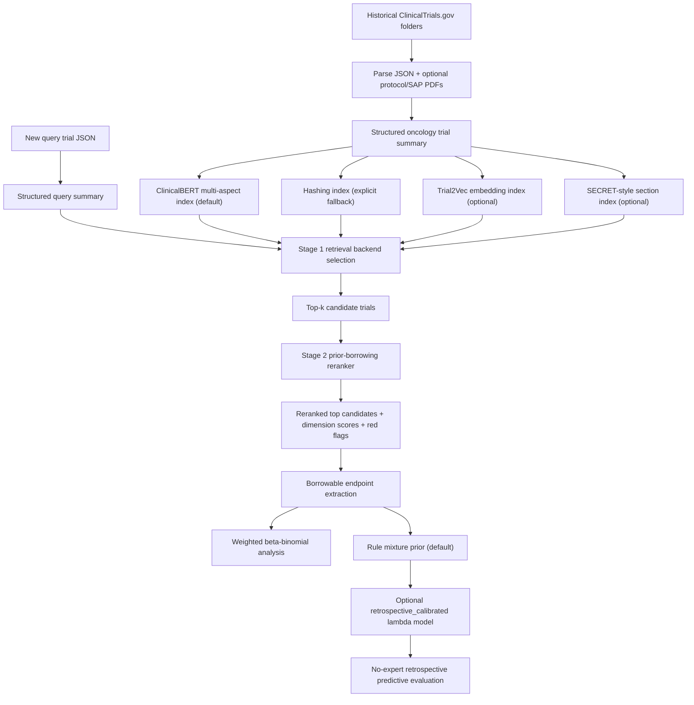

# Trial2Vec / SECRET Interface / Mixture Prior Pipeline Update Report

日期：2026-06-03  
分支：`codex/trial2vec-secret-mixture-prior`  
核心实现提交截至：`58021fe Add retrospective lambda evaluation`
状态：feature branch 已完成并保留，尚未 merge 回 `main`。

## 1. 总结

这次改动把原来的 oncology trial similarity pipeline 从“ClinicalBERT/hash embedding + rule-based rerank + weighted beta-binomial borrowing”扩展成一个更完整的两阶段候选发现和 Bayesian prior construction 框架：

1. Stage 1 现在支持可切换 retrieval backend：
   - 默认：Bio_ClinicalBERT multi-aspect embedding。
   - 轻量 fallback：hashing embedding，需要显式指定。
   - 可选增强：Trial2Vec retrieval backend。
   - SECRET-style：新增可运行 MVP，使用 deterministic Q/A sections 和 section-weighted vector search。

2. Stage 2 继续使用 structured prior-borrowing reranker：
   - 对 disease / regimen / endpoint / eligibility / design / result usability / safety-follow-up 打分。
   - 输出 `overall_similarity_score`、`suggested_borrowing_discount`、`red_flags` 和 `borrowable_quantities`。

3. Bayesian 部分新增 experimental mixture prior：
   - 原来的 weighted beta-binomial power-prior approximation 保留。
   - 新增 `mixture_prior` 输出，把每个候选 trial 变成一个 beta prior component。
   - 明确区分 `a_i` 和 `lambda_i`：
     - `a_i` / `discount_i` 控制历史样本量进入 beta component 的折扣。
     - `lambda_i` 控制 mixture prior 中该 component 被选中的先验概率权重。

4. 新增 retrospective lambda training 脚本：
   - 可以从已完成 historical trials / pipeline result JSONL 构造训练样本。
   - 使用完整 9-feature `x_i` 训练一个小型 neural network 来预测 `lambda_i`。
   - 可保存/加载 lambda model artifact，并可在 search 时选择 `retrospective_calibrated` mixture-prior mode。
   - pseudo-query search 可用 `--hide-query-outcomes-for-retrieval` 将真实 outcome 从 retrieval/rerank/feature construction 中隐藏，避免 leakage。

5. 新增 retrospective evaluation 脚本：
   - 无专家评审标签时，用 pseudo-query held-out outcome 的 predictive NLL 比较 weak-only / rule lambda / learned lambda。
   - 明确记录 leakage-control assumption。
   - 默认拒绝没有 `retrospective_leakage_control.query_outcomes_hidden_from_retrieval=true` metadata 的 pipeline results JSONL。

6. 新增测试和 smoke verification：
   - 89 个 unit tests 通过。
   - py_compile 通过。
   - ClinicalBERT smoke 和 Trial2Vec targeted smoke 都产生了可用的 Bayesian analysis 和 mixture prior。
   - SECRET-style smoke 验证了 build-secret-index、secret retrieval、section scores 和 rerank 输出路径。

## 2. 改动文件概览

| 文件 | 主要改动 |
| --- | --- |
| `docs/oncology_trial_similarity_pipeline.py` | 主 pipeline 接入 retrieval backend selection、Trial2Vec search path、mixture prior Bayesian output、ClinicalBERT 默认 backend、hashing index 真实 backend 报告。 |
| `docs/secret_retrieval.py` | 新增 SECRET-style Q/A section construction、section weights、section-vector cosine scoring。 |
| `docs/mixture_prior.py` | 新增纯 Python mixture-prior 数学工具：lambda normalization、beta-binomial predictive probability、posterior component responsibility、从 reranked rows 构造 mixture components、retrospective calibrated lambda replacement。 |
| `scripts/build_trial2vec_index.py` | 新增 Trial2Vec embedding index builder，从 `trial_summaries.jsonl` 生成 `.npz` 向量索引。 |
| `scripts/train_retrospective_lambda_model.py` | 新增 retrospective lambda model 训练脚本，从 pipeline results JSONL 训练完整 9-feature `lambda_i` scorer，并可输出 model artifact。 |
| `scripts/evaluate_retrospective_lambda_model.py` | 新增无专家标签 retrospective evaluation，输出 weak-only / rule / learned predictive NLL。 |
| `tests/test_stage1_backends.py` | 新增 Stage 1 backend、Trial2Vec、pandas compatibility、hashing reporting 测试。 |
| `tests/test_mixture_prior.py` | 新增 mixture-prior 数学、校验、component construction 测试。 |
| `tests/test_retrospective_lambda_training.py` | 新增 lambda training loss、9-feature schema validation、artifact save/load、非法输入 validation、pipeline result example builder 测试。 |
| `tests/test_retrospective_lambda_evaluation.py` | 新增 deterministic split、evaluation metrics、JSON output、leakage assumption 测试。 |
| `tests/test_web_agent.py` | 更新 web agent Bayesian output / mixture prior 相关测试。 |
| `README.md`、`web_agent/README.md`、pipeline explanation docs | 更新 Trial2Vec、SECRET、mixture prior、lambda training 的说明。 |

本轮 feature branch 涉及 Stage 1 retrieval、Stage 2 rerank、mixture prior、retrospective lambda training/evaluation 和文档/测试更新。

## 3. 改动后的完整 Pipeline



### 3.1 Offline Indexing

Offline indexing 仍然先把每个 NCT folder 转成统一的 structured summary：

1. 读取 ClinicalTrials.gov JSON。
2. 查找 protocol / SAP PDF，抽取可用文本片段。
3. 归一化：
   - cancer type / histology / line of therapy。
   - intervention / regimen / drug class。
   - endpoint family / title / time frame / arm-level count-denominator。
   - phase / arm structure / randomization。
   - posted results / borrowable quantities / safety-follow-up。
4. 生成 `trial_summaries.jsonl`。
5. 根据 backend 构建 embedding index。

当前默认 build-index backend 已改为 ClinicalBERT：

```bash
python3 docs/oncology_trial_similarity_pipeline.py build-index \
  --db-root /path/to/Oncology_All_Trials \
  --output-dir artifacts/oncology_trial_similarity
```

如果只想做本地快速 smoke test，需要显式使用 hashing：

```bash
python3 docs/oncology_trial_similarity_pipeline.py build-index \
  --db-root /path/to/Oncology_All_Trials \
  --output-dir artifacts/oncology_trial_similarity_hashing \
  --embedding-backend hashing
```

### 3.2 Stage 1 Retrieval

Stage 1 的目标不是最终决定是否 borrowing，而是 high-recall candidate discovery。它负责把可能相关的 historical trials 找出来，然后交给 Stage 2 做更严格的 prior-borrowing suitability 判断。

#### ClinicalBERT backend

默认 backend 是 Bio_ClinicalBERT multi-aspect embedding。每个 trial 不被压成一整段文本，而是分成多个 aspect：

```text
disease_population
intervention
endpoint
design
results_safety
```

每个 aspect 都生成一个 ClinicalBERT mean-pooling 向量。query 和 candidate 的相似度为加权 cosine similarity：

```text
s_stage1(q, c)
= 0.30 cos(q_disease, c_disease)
+ 0.25 cos(q_intervention, c_intervention)
+ 0.20 cos(q_endpoint, c_endpoint)
+ 0.15 cos(q_design, c_design)
+ 0.10 cos(q_results, c_results)
```

这次修复还解决了一个 reporting 问题：如果 index 是旧的 hashing index，search 结果现在会报告 `retrieval_backend: "hashing"`，不会错误显示为 `clinicalbert`。

#### Hashing backend

Hashing backend 仍保留，但定位变成 explicit fallback / smoke-test backend。它不依赖 transformer 模型，适合快速测试数据流是否可跑通，但不应该作为主分析默认路径。

#### Trial2Vec backend

新增 Trial2Vec optional backend。流程是：

1. 从 `trial_summaries.jsonl` 转成 Trial2Vec 所需字段：
   - `nct_id`
   - `title`
   - `description`
   - `criteria`
   - `disease`
   - `intervention_name`
   - `outcome_measure`
   - `overall_status`
   - `keyword`
   - `reference`
2. 用 pretrained Trial2Vec model 生成 trial-level embedding。
3. 保存为 `.npz` index：
   - `nct_ids`
   - `embeddings`
   - `retrieval_backend=trial2vec`
4. search 时 query 也经过同样 summary-to-Trial2Vec-row，再编码成 query vector。
5. 用 cosine similarity 对 Trial2Vec embedding 排序。

示例：

```bash
python3 scripts/build_trial2vec_index.py \
  --summaries-path artifacts/oncology_trial_similarity_clinicalbert/trial_summaries.jsonl \
  --output-path artifacts/oncology_trial_similarity_clinicalbert/trial2vec_embeddings.npz \
  --trial2vec-model-dir artifacts/trial2vec/pretrained_model

python3 docs/oncology_trial_similarity_pipeline.py search \
  --query-json /path/to/query.json \
  --index-dir artifacts/oncology_trial_similarity_clinicalbert \
  --retrieval-backend trial2vec \
  --trial2vec-index-path artifacts/oncology_trial_similarity_clinicalbert/trial2vec_embeddings.npz \
  --trial2vec-model-dir artifacts/trial2vec/pretrained_model \
  --top-k 10 \
  --rerank \
  --rerank-top-n 10
```

#### SECRET-style backend

SECRET-style backend 现在是可运行 MVP。它不是完整复刻 SECRET 论文的 LLM protocol summarization/reviewer workflow，而是把当前 structured summary 转成一组 deterministic Q/A sections，再按 section 做 embedding 和加权 cosine scoring。

当前 sections：

```text
disease_population
intervention
eligibility
endpoint
design
results
safety_followup
```

section 权重保存在 `docs/secret_retrieval.py` 的 `SECRET_SECTION_WEIGHTS`。每个候选 trial 的 section vectors 保存到 `secret_embeddings.npz`，search 时 query 也生成相同 sections，然后逐 section 计算 cosine similarity：

```text
s_secret(q, c) = sum_k w_k * cos(q_k, c_k)
```

构建 SECRET-style index 示例：

```bash
python3 docs/oncology_trial_similarity_pipeline.py build-secret-index \
  --index-dir artifacts/oncology_trial_similarity_clinicalbert \
  --embedding-backend clinicalbert
```

快速 smoke test 可以用 hashing backend：

```bash
python3 docs/oncology_trial_similarity_pipeline.py build-secret-index \
  --index-dir artifacts/oncology_trial_similarity_clinicalbert \
  --output-path artifacts/oncology_trial_similarity_clinicalbert/secret_embeddings_smoke.npz \
  --embedding-backend hashing
```

SECRET-style search 示例：

```bash
python3 docs/oncology_trial_similarity_pipeline.py search \
  --query-json /path/to/query.json \
  --index-dir artifacts/oncology_trial_similarity_clinicalbert \
  --retrieval-backend secret \
  --secret-index-path artifacts/oncology_trial_similarity_clinicalbert/secret_embeddings.npz \
  --top-k 10 \
  --rerank \
  --rerank-top-n 10
```

输出候选行包含 `retrieval_backend: "secret"` 和 `secret_section_scores`，方便检查每个 section 的贡献。

### 3.3 Stage 2 Prior-Borrowing Reranker

Stage 2 使用 structured clinical/statistical rules 判断 candidate 是否适合作为 Bayesian historical prior。

它输出七个 dimension scores：

```text
disease_population_match
treatment_regimen_match
endpoint_estimand_match
eligibility_criteria_overlap
design_phase_match
result_usability
safety_and_followup_relevance
```

这些分数都是 0 到 5 的 structured score。加权 dimension score 为：

```text
dimension_score
= 0.25 disease
+ 0.20 treatment
+ 0.20 endpoint
+ 0.10 eligibility
+ 0.10 design
+ 0.10 result
+ 0.05 safety_followup
```

`eligibility_criteria_overlap` 只从 `key_inclusion` / `key_exclusion` 的实际文本抽 token，不把 JSON schema key 当成医学证据；同时过滤 adult/patient/study 等 boilerplate 词，避免无临床含义的假 overlap。

转成 0 到 100 的 clinical score：

```text
clinical_score = 20 * dimension_score
```

最终 Stage 2 score 结合 structured clinical score 和 Stage 1 retrieval score：

```text
overall_similarity_score
= 0.75 * clinical_score + 0.25 * retrieval_score
```

然后根据 overall score 给出 borrowing suitability 和初始 discount：

| 条件 | suitability | suggested discount |
| --- | --- | ---: |
| `overall >= 80` 且没有 Low red flags | `high` | 0.75 |
| `overall >= 60` | `medium` | 0.40 |
| `overall >= 40` | `low` | 0.15 |
| 其他 | `do_not_borrow` | 0.00 |

Stage 2 还会输出：

- `red_flags`：例如 disease mismatch、regimen mismatch、endpoint mismatch、没有 posted results。
- `borrowable_quantities`：可用于 Bayesian borrowing 的 endpoint arm-level count / denominator。
- `required_adjustments`：建议使用 robust mixture prior、discounting 或 do-not-borrow 等。

### 3.4 Bayesian Weighted Beta-Binomial Analysis

原来的 Bayesian output 保留，模型名仍是：

```text
weighted_beta_binomial_path_a
```

对每个 endpoint family，例如 ORR，pipeline 会：

1. 从 query summary 中找 query treatment arm 的 `count` 和 `denominator`。
2. 从 Stage 2 reranked candidates 中提取同 endpoint family 的 historical observations。
3. 对每个 historical observation 使用 Stage 2 给出的 discount 作为 power-prior style weight。
4. 使用 Beta(1, 1) 作为基础弱先验。
5. 构造 weighted historical prior：

```text
alpha_prior = 1 + sum_i w_i * y_i
beta_prior  = 1 + sum_i w_i * (n_i - y_i)
ESS         = sum_i w_i * n_i
weighted_rate = sum_i w_i*y_i / sum_i w_i*n_i
```

如果 query 已有 observed result，则继续更新 posterior：

```text
alpha_post = alpha_prior + y_query
beta_post  = beta_prior + n_query - y_query
```

如果 query 没有结果，则输出 prior-only analysis。

### 3.5 Experimental Mixture Prior

这次新增的 `mixture_prior` 是 sensitivity-analysis extension，不替代主 weighted beta-binomial output。

每个有效 candidate 生成一个 beta component：

```text
a_i = discount_i
alpha_i = 1 + a_i * y_i
beta_i  = 1 + a_i * (n_i - y_i)
```

其中：

- `y_i`：candidate treatment arm 的 endpoint event count。
- `n_i`：candidate treatment arm denominator。
- `a_i` / `discount_i`：Stage 2 给出的 borrowing discount，控制 effective sample size。

然后计算 rule-based raw mixture weight：

```text
raw_weight_i
= gate_i * discount_i * max(overall_similarity_score_i, 0) / 100 * log(1 + n_i)
```

其中 conservative gate：

```text
gate_i = 0                         if endpoint_score < 1.5 or result_score <= 0
gate_i = gate_i * 0.2              if disease_score < 1.5
gate_i = gate_i * 0.6              if 1.5 <= disease_score < 2.5
gate_i = gate_i * 0.5              if red_flags contain a Low-* warning
```

最后归一化：

```text
lambda_0 = 0.2
lambda_i = (1 - lambda_0) * raw_weight_i / sum_j raw_weight_j
```

如果所有 raw weights 都是 0，则 fallback 到 weak-only prior：

```text
lambda_0 = 1
lambda_i = 0
```

最终 mixture prior 形式为：

```text
p(theta)
= lambda_0 * Beta(theta | 1, 1)
+ sum_i lambda_i * Beta(theta | alpha_i, beta_i)
```

这里最重要的区分是：

- `a_i` / `discount_i`：candidate 内部的 sample-size discount。
- `lambda_i`：candidate 作为一个 mixture component 的 model probability。

所以一个 trial 即使样本量很大，也不会自动获得很大 `lambda_i`；它还需要 endpoint、result usability、disease、red flags 等 gate 通过。

当前 mixture prior 有两个 mode：

```text
rule
retrospective_calibrated
```

默认 `rule` mode 保留原始 `lambda_rule`。如果传入训练好的 lambda model artifact，则 pipeline 可以进入 `retrospective_calibrated` mode，把 learned model score 转成 `lambda_model` / `lambda_active`，同时保留 `lambda_rule` 供审阅比较：

```bash
python3 docs/oncology_trial_similarity_pipeline.py search \
  --query-json /path/to/query.json \
  --index-dir artifacts/oncology_trial_similarity_clinicalbert \
  --top-k 10 \
  --rerank \
  --mixture-prior-mode retrospective_calibrated \
  --lambda-model-path artifacts/lambda_model.pt
```

重要 caveat：这里没有使用专家评审标签。`retrospective_calibrated` 表示用 retrospective predictive loss 训练出来的替代校准信号，不等价于 expert validation。

### 3.6 Retrospective Lambda Training

新增脚本：

```text
scripts/train_retrospective_lambda_model.py
```

它支持两种输入：

1. 手写或程序生成的 `examples.jsonl`。
2. leakage-safe pipeline results JSONL，通过 `--pipeline-results-jsonl` 自动构造训练样本。

对于 completed trials 作为 pseudo-query 的 retrospective run，必须先在 search 时隐藏 query outcomes：

```bash
python3 docs/oncology_trial_similarity_pipeline.py search \
  --query-json /path/to/completed_trial.json \
  --index-dir artifacts/oncology_trial_similarity_clinicalbert \
  --top-k 10 \
  --rerank \
  --hide-query-outcomes-for-retrieval \
  --output artifacts/pseudo_query_result.json
```

此时输出会包含：

```text
retrospective_leakage_control.query_outcomes_hidden_from_retrieval = true
heldout_query_outcomes
```

retrieval/rerank/feature construction 使用去 outcome 后的 `query_summary`；`heldout_query_outcomes` 是 post-retrieval held-out outcome source，可用于 training loss、evaluation 和 Bayesian analysis 展示，但不参与 retrieval/rerank/feature construction/model selection。

当前模型是一个小型 MLP：

```text
score_i = f_theta(x_i)
```

当前脚本已经使用完整 9-feature `x_i`，顺序由 `LAMBDA_FEATURE_NAMES` 固定并在训练/加载 artifact 时校验：

```text
x_i = [
  s_i,
  disease_match_i,
  regimen_match_i,
  endpoint_match_i,
  followup_match_i,
  eligibility_match_i,
  result_quality_i,
  -redflag_severity_i,
  log(n_i)
]
```

其中：

- `s_i`：Stage 2 `overall_similarity_score_i / 100`。
- `disease_match_i`：disease/population score 除以 5。
- `regimen_match_i`：treatment regimen score 除以 5。
- `endpoint_match_i`：endpoint/estimand score 除以 5。
- `followup_match_i`：safety/follow-up 或 outcome follow-up score 除以 5。
- `eligibility_match_i`：eligibility criteria overlap score 除以 5。
- `result_quality_i`：result usability score 除以 5。
- `-redflag_severity_i`：red flags severity 的负值，越严重越低。
- `log(n_i)`：候选 endpoint denominator 的 `log(1+n_i)`。

训练时先把 candidate budget 设为 `1 - lambda_0`，再用 gate-masked softmax 得到 neural lambda：

```text
lambda_i(theta)
= (1 - lambda_0) * softmax_i(score_i + log(gate_i))
```

如果所有 gate 都是 0，则 fallback 到 weak-only：

```text
lambda_0 = 1
lambda_i = 0
```

训练 loss 是：

```text
Loss
= -log [
    lambda_0 * p_beta_binomial(y_query | n_query, Beta(1,1))
    + sum_i lambda_i(theta) * p_beta_binomial(y_query | n_query, Beta(alpha_i,beta_i))
  ]
  + rho * KL(lambda_rule || lambda_theta)
  + ESS_penalty
```

这表示：

- 第一项：让 mixture prior 对 held-out query outcome 有更高 predictive probability。
- KL 项：让神经网络不要完全脱离 rule-based lambda，除非数据支持。
- ESS penalty：防止模型把过多权重推向超大样本量 historical components。

这次最后一轮 review fix 还加强了训练输入校验：

- `feature_names` 必须等于完整 `LAMBDA_FEATURE_NAMES`。
- `features` 必须是 9 列，旧 compact 4/5 列样本会被拒绝。
- `lambda_0` 必须 finite 且在 `[0, 1]`。
- query denominator 必须 finite 且 `> 0`。
- query count 必须 finite、`>= 0` 且 `<= denominator`。
- component `alpha` / `beta` 必须 finite 且 `> 0`。

这样 malformed JSONL 不会进入 tensor loss math 产生 NaN 或不合法的 predictive loss。

训练并保存 model artifact 示例：

```bash
python3 scripts/train_retrospective_lambda_model.py \
  --pipeline-results-jsonl artifacts/pseudo_query_results.jsonl \
  --output-json artifacts/lambda_training_summary.json \
  --model-output artifacts/lambda_model.pt
```

CLI 输出 JSON 会过滤掉 PyTorch model object，并使用 strict JSON serialization，避免写出非标准 `NaN`。

如果 `--pipeline-results-jsonl` 中的记录没有声明 `query_outcomes_hidden_from_retrieval=true`，训练脚本会拒绝使用，避免把 leaky pseudo-query run 当成合法 retrospective training 数据。

### 3.7 No-Expert Retrospective Evaluation

新增脚本：

```text
scripts/evaluate_retrospective_lambda_model.py
```

它用于没有专家评审标签时的替代评估：把 completed trials 作为 pseudo-queries，做 deterministic train/eval split，并在 held-out pseudo-query outcome 上比较三种 predictive NLL：

```text
weak_only_mean_nll
rule_lambda_mean_nll
learned_lambda_mean_nll
learned_minus_rule_mean_nll
```

评估命令示例：

```bash
python3 scripts/evaluate_retrospective_lambda_model.py \
  --pipeline-results-jsonl artifacts/pseudo_query_results.jsonl \
  --output-json artifacts/retrospective_lambda_evaluation.json \
  --train-fraction 0.8 \
  --seed 20260603
```

和训练脚本一样，evaluation 脚本默认要求 pipeline result JSONL 带有 leakage-control metadata；普通 search 输出或未隐藏 query outcomes 的 completed-trial run 不会被静默接受。

报告会显式写入：

```text
Query outcomes must be hidden from retrieval/reranking/feature construction/model selection
and reserved for post-retrieval predictive loss/evaluation/analysis.
```

这一步是 retrospective predictive calibration，不是专家评审替代品。manuscript-level claim 仍应报告缺少 human/statistical expert review 的限制。

## 4. 当前输出 Schema 重点

搜索输出的 top-level 关键字段：

```text
retrieval_backend
embedding_backend
embedding_model
query_summary
top_matches
top10
reranked_top_matches
reranked_top10
bayesian_analysis
```

其中：

- `retrieval_backend`：实际 Stage 1 retrieval source。
  - ClinicalBERT index：`clinicalbert`
  - Hashing index：`hashing`
  - Trial2Vec search：`trial2vec`
  - SECRET-style search：`secret`
- `embedding_backend`：index 内保存的 embedding backend。
- `reranked_top10`：Stage 2 prior-borrowing rerank 后的 top candidates。
- `bayesian_analysis.endpoint_analyses[*].mixture_prior`：新增 mixture prior 输出。

一个 mixture component 形如：

```json
{
  "nct_id": "NCT03329378",
  "endpoint_key": "ORR",
  "count": 1.0,
  "denominator": 2.0,
  "rate": 0.5,
  "discount": 0.75,
  "gate": 1.0,
  "alpha": 1.75,
  "beta": 1.75,
  "raw_weight": 0.7446943398736782,
  "lambda_rule": 0.04338377409078168,
  "lambda_features": [0.82, 1.0, 0.8, 1.0, 0.4, 0.2, 1.0, -0.0, 3.93]
}
```

在 `retrospective_calibrated` mode 中，同一个 component 会额外包含：

```json
{
  "lambda_model": 0.061,
  "lambda_active": 0.061
}
```

`lambda_rule` 不会被覆盖，便于比较 rule-based prior weight 和 learned active weight。

## 5. Smoke Results 展示

### 5.1 Trial2Vec index artifacts

| Artifact | nct_ids | embedding shape | backend |
| --- | ---: | --- | --- |
| `trial2vec_embeddings_smoke8.npz` | 8 | `(8, 128)` | `trial2vec` |
| `trial2vec_embeddings_targeted.npz` | 10 | `(10, 128)` | `trial2vec` |

完整全库 Trial2Vec index build 曾被手动中断，因为第 1/15 batch 约 9.5 分钟，估计全量运行会超过 2 小时；这不是 correctness failure。为了验证 pipeline 正确性，使用了 smoke8 和 targeted top10 subset。

### 5.2 ClinicalBERT smoke search

输出文件：

```text
/Users/wang/Documents/New project/artifacts/smoke_clinicalbert_mixture_prior.json
```

摘要：

| 字段 | 值 |
| --- | --- |
| `retrieval_backend` | `clinicalbert` |
| `embedding_backend` | `clinicalbert` |
| `embedding_model` | `emilyalsentzer/Bio_ClinicalBERT` |
| `top_matches` length | 3 |
| `reranked_top10` length | 10 |
| `bayesian_analysis.status` | `available` |
| endpoint | `ORR` |
| analysis mode | `posterior` |
| historical trials used | 11 |
| effective sample size | 361.65 |
| weighted historical rate | 0.400387 |
| mixture `lambda_0` | 0.2 |
| mixture components | 9 |

解释：

- ClinicalBERT search path 能正常返回候选。
- Stage 2 rerank 产生了 top10 prior-borrowing candidates。
- Bayesian output 识别到 ORR endpoint，并且产生 posterior mode analysis。
- Mixture prior 中有 9 个可用 historical beta components；`lambda_0=0.2` 表示 weak prior component 保留 20% 先验质量。

### 5.3 Trial2Vec targeted smoke search

输出文件：

```text
/Users/wang/Documents/New project/artifacts/smoke_trial2vec_mixture_prior.json
```

摘要：

| 字段 | 值 |
| --- | --- |
| `retrieval_backend` | `trial2vec` |
| `embedding_backend` | `trial2vec` |
| `embedding_model` | `/Users/wang/Documents/New project/artifacts/trial2vec/pretrained_model` |
| `top_matches` length | 10 |
| `reranked_top10` length | 10 |
| first candidate backend | `trial2vec` |
| `bayesian_analysis.status` | `available` |
| endpoint | `ORR` |
| analysis mode | `posterior` |
| historical trials used | 9 |
| effective sample size | 340.85 |
| weighted historical rate | 0.3858 |
| mixture `lambda_0` | 0.2 |
| mixture components | 9 |
| sum(`lambda_rule`) | 0.8 |
| total prior mass | 1.0 |

Top reranked candidate 示例：

```json
{
  "candidate_nct_id": "NCT03329378",
  "overall_similarity_score": 90.38,
  "suggested_borrowing_discount": 0.75,
  "dimension_scores": {
    "disease_population_match": 4.25,
    "treatment_regimen_match": 5.0,
    "endpoint_estimand_match": 5.0,
    "eligibility_criteria_overlap": 0.0,
    "design_phase_match": 5.0,
    "result_usability": 5.0,
    "safety_and_followup_relevance": 0.0
  },
  "red_flags": [],
  "borrowable_quantities_count": 1
}
```

解释：

- Trial2Vec path 能作为 Stage 1 retrieval backend 返回 candidates。
- Candidate rows 中 `retrieval_backend` 保持为 `trial2vec`，说明 backend reporting 正确。
- Stage 2 将 top candidate 判为 high suitability，给出 `suggested_borrowing_discount=0.75`。
- ORR Bayesian analysis 可用，mixture prior 有 9 个 components。
- `lambda_0=0.2`，候选 components 的 `lambda_rule` 总和为 0.8，总 prior mass 为 1.0，说明 mixture normalization 正确。

### 5.4 SECRET-style smoke search

为了避免全库 SECRET search smoke 在本地 PDF/全量 summary 路径上耗时过长，最终使用已有 `trial_summaries_smoke8.jsonl` 构造小型 SECRET-style hashing index：

```text
/Users/wang/Documents/New project/artifacts/secret_smoke_small/secret_embeddings_smoke8.npz
```

输出文件：

```text
/Users/wang/Documents/New project/artifacts/secret_smoke_small/smoke_secret_mixture_prior.json
```

摘要：

| 字段 | 值 |
| --- | --- |
| `retrieval_backend` | `secret` |
| `embedding_backend` | `hashing` |
| `top_matches` length | 3 |
| `reranked_top10` length | 3 |
| first candidate backend | `secret` |
| `secret_section_scores` | present |
| sections | disease_population / intervention / eligibility / endpoint / design / results / safety_followup |
| `bayesian_analysis.status` | `not_available` |

解释：

- `build-secret-index` 能从 summaries 构建 section-vector `.npz`。
- `search --retrieval-backend secret` 能返回 candidates，并保留 `secret_section_scores`。
- smoke8 小样本没有形成可用的 endpoint borrowing analysis，因此 Bayesian status 为 `not_available`；这不影响 SECRET retrieval path 验证。

## 6. 验证结果

已完成的验证：

| 验证 | 结果 |
| --- | --- |
| `python -m unittest discover -s tests -v` | 89 tests OK |
| `python -m py_compile docs/oncology_trial_similarity_pipeline.py docs/mixture_prior.py docs/secret_retrieval.py scripts/build_trial2vec_index.py scripts/train_retrospective_lambda_model.py scripts/evaluate_retrospective_lambda_model.py` | exit 0 |
| `build-secret-index` smoke with hashing | exit 0 |
| SECRET-style smoke search on smoke8 summaries | exit 0; `secret_section_scores` present |
| Task 4/5 reviewer subagents | APPROVED after fixes |

备注：

- Retrospective lambda training tests 中出现的 argparse usage output 是预期错误路径测试，不是 test failure。
- Full Trial2Vec all-summary index build 未完成是 runtime/cost 问题，不是 correctness failure；smoke 和 targeted index 已验证编码、search、rerank、Bayesian output path。
- 全库 SECRET search smoke 曾因本地全量路径耗时过长被中断；小型 smoke8 SECRET search 已验证可运行路径。

## 7. 已完成的第 7 节改进与剩余限制

1. SECRET-style backend 已从 future interface 升级为 runnable MVP：
   - 新增 `docs/secret_retrieval.py`，可从 structured summary 构造 deterministic Q/A sections。
   - 新增 `build-secret-index` 和 `--retrieval-backend secret` search path。
   - 输出 `secret_section_scores`，可以查看 disease/intervention/eligibility/endpoint/design/results/safety-followup 各 section 的贡献。
   - 剩余限制：这仍是 SECRET-style deterministic MVP，不是完整 SECRET 论文中的 LLM protocol summarization + reviewer-facing explanation system。

2. Lambda training 已扩展到完整 9-feature `x_i`：

```text
x_i = [
  s_i,
  disease_match_i,
  regimen_match_i,
  endpoint_match_i,
  followup_match_i,
  eligibility_match_i,
  result_quality_i,
  -redflag_severity_i,
  log(n_i)
]
```

   - `feature_names` 必须严格匹配 `LAMBDA_FEATURE_NAMES`。
   - 旧 compact feature examples 会被拒绝，不会悄悄训练出 4/5 输入维度的模型。
   - `eligibility_match_i` 已从 Stage 2 eligibility overlap 得到；`-redflag_severity_i` 已从 red flags severity 得到。

3. Retrospective evaluation 已可运行：
   - 新增 `scripts/evaluate_retrospective_lambda_model.py`。
   - 用 deterministic train/eval split 评估 `weak_only_mean_nll`、`rule_lambda_mean_nll`、`learned_lambda_mean_nll`。
   - held-out pseudo-query outcome 不参与 retrieval/rerank/feature/model selection；只在 post-retrieval 阶段用于 predictive loss、evaluation 或 analysis。
   - `--pipeline-results-jsonl` 默认要求 search output 带有 `retrospective_leakage_control.query_outcomes_hidden_from_retrieval=true`。
   - 生成 pseudo-query result 时应使用 `--hide-query-outcomes-for-retrieval`。
   - learned evaluation 使用纯 predictive NLL，不混入训练期 KL 或 ESS penalty。

4. 没有专家评审标签：
   - 本轮实现没有使用 human expert labels。
   - 替代训练信号是 retrospective predictive performance。
   - 因此 `retrospective_calibrated` 是 predictive calibration，不是 expert validation。
   - manuscript-level claim 仍应明确报告缺少 human/statistical expert review 的限制。

5. Mixture prior 默认仍保持 rule-based，另有 opt-in calibrated mode：
   - 默认 search 输出 `mode: "rule"`，使用 `lambda_rule`。
   - 如果提供 `--mixture-prior-mode retrospective_calibrated --lambda-model-path ...`，则使用 model artifact 生成 `lambda_model` / `lambda_active`。
   - `lambda_rule` 被保留，方便审阅 learned weights 是否偏离 rule weights。
   - 主 Bayesian output 仍保留 weighted beta-binomial path A；mixture prior 仍是 sensitivity / calibration extension，不建议在没有进一步验证时作为唯一主分析。

## 8. 一句话版结论

这次更新把 pipeline 从单一路径的 ClinicalBERT similarity prototype，升级成了一个可切换 Stage 1 retrieval backend、可解释 Stage 2 prior-borrowing rerank、并能输出 rule/calibrated mixture prior 与 no-expert retrospective predictive evaluation 的系统；ClinicalBERT 仍是默认稳定路径，Trial2Vec 和 SECRET-style backend 都已可作为 optional high-recall retriever 跑通，mixture prior 的 `a_i`、`lambda_rule`、`lambda_model` 和 `lambda_active` 已经在代码中明确分离并经过测试验证。
