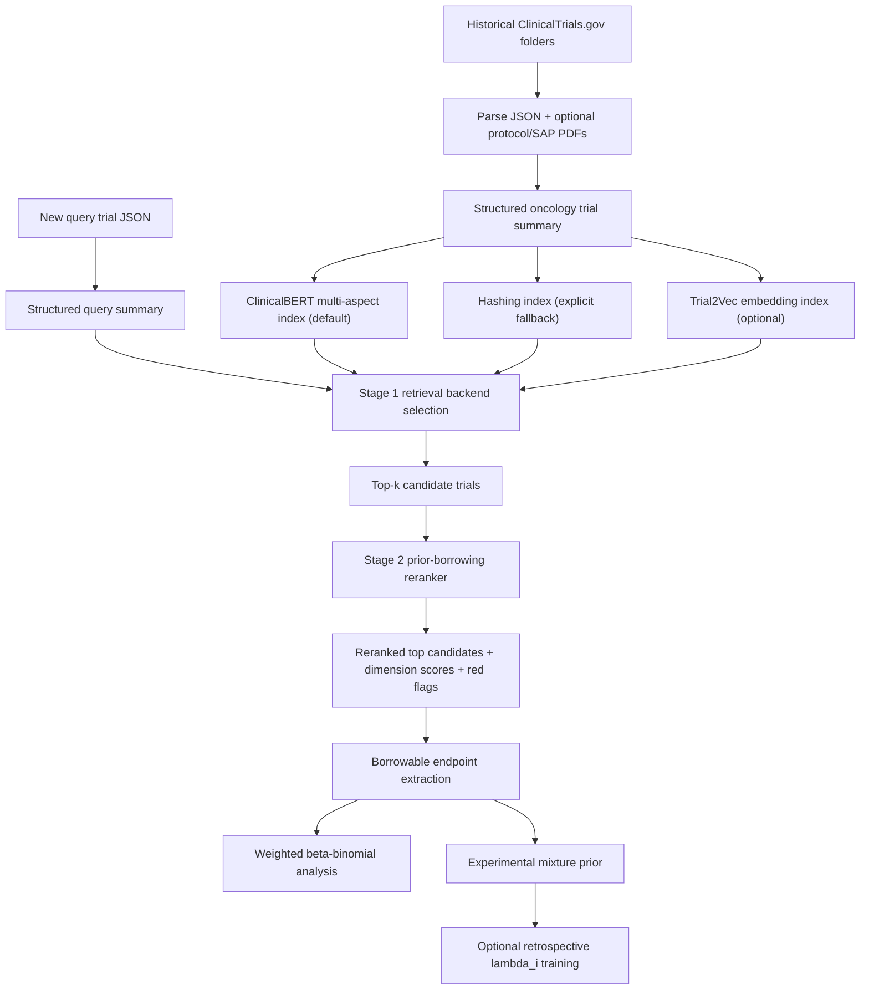

# Trial2Vec / SECRET Interface / Mixture Prior Pipeline Update Report

日期：2026-06-03  
分支：`codex/trial2vec-secret-mixture-prior`  
核心实现提交截至：`77ccc47 Align retrieval defaults and lambda validation`  
状态：feature branch 已完成并保留，尚未 merge 回 `main`。

## 1. 总结

这次改动把原来的 oncology trial similarity pipeline 从“ClinicalBERT/hash embedding + rule-based rerank + weighted beta-binomial borrowing”扩展成一个更完整的两阶段候选发现和 Bayesian prior construction 框架：

1. Stage 1 现在支持可切换 retrieval backend：
   - 默认：Bio_ClinicalBERT multi-aspect embedding。
   - 轻量 fallback：hashing embedding，需要显式指定。
   - 可选增强：Trial2Vec retrieval backend。
   - SECRET：保留接口和设计位置，但当前明确返回未实现，而不是假装已经支持。

2. Stage 2 继续使用 structured prior-borrowing reranker：
   - 对 disease / regimen / endpoint / design / result usability / safety-follow-up 打分。
   - 输出 `overall_similarity_score`、`suggested_borrowing_discount`、`red_flags` 和 `borrowable_quantities`。

3. Bayesian 部分新增 experimental mixture prior：
   - 原来的 weighted beta-binomial power-prior approximation 保留。
   - 新增 `mixture_prior` 输出，把每个候选 trial 变成一个 beta prior component。
   - 明确区分 `a_i` 和 `lambda_i`：
     - `a_i` / `discount_i` 控制历史样本量进入 beta component 的折扣。
     - `lambda_i` 控制 mixture prior 中该 component 被选中的先验概率权重。

4. 新增 retrospective lambda training 脚本：
   - 可以从已完成 historical trials / pipeline result JSONL 构造训练样本。
   - 用 held-out query outcome 训练一个小型 neural network 来预测 `lambda_i`。
   - 新 query 的真实 outcome 不允许用于训练或调参，避免 leakage。

5. 新增测试和 smoke verification：
   - 58 个 unit tests 通过。
   - py_compile 通过。
   - ClinicalBERT smoke 和 Trial2Vec targeted smoke 都产生了可用的 Bayesian analysis 和 mixture prior。

## 2. 改动文件概览

| 文件 | 主要改动 |
| --- | --- |
| `docs/oncology_trial_similarity_pipeline.py` | 主 pipeline 接入 retrieval backend selection、Trial2Vec search path、mixture prior Bayesian output、ClinicalBERT 默认 backend、hashing index 真实 backend 报告。 |
| `docs/mixture_prior.py` | 新增纯 Python mixture-prior 数学工具：lambda normalization、beta-binomial predictive probability、posterior component responsibility、从 reranked rows 构造 mixture components。 |
| `scripts/build_trial2vec_index.py` | 新增 Trial2Vec embedding index builder，从 `trial_summaries.jsonl` 生成 `.npz` 向量索引。 |
| `scripts/train_retrospective_lambda_model.py` | 新增 retrospective lambda model 训练脚本，从专家样本或 pipeline results JSONL 训练 `lambda_i` scorer。 |
| `tests/test_stage1_backends.py` | 新增 Stage 1 backend、Trial2Vec、pandas compatibility、hashing reporting 测试。 |
| `tests/test_mixture_prior.py` | 新增 mixture-prior 数学、校验、component construction 测试。 |
| `tests/test_retrospective_lambda_training.py` | 新增 lambda training loss、shape validation、非法输入 validation、pipeline result example builder 测试。 |
| `tests/test_web_agent.py` | 更新 web agent Bayesian output / mixture prior 相关测试。 |
| `README.md`、`web_agent/README.md`、pipeline explanation docs | 更新 Trial2Vec、SECRET、mixture prior、lambda training 的说明。 |

整体 diff：12 个文件，约 2176 行新增、84 行删除。

## 3. 改动后的完整 Pipeline



### 3.1 Offline Indexing

Offline indexing 仍然先把每个 NCT folder 转成统一的 structured summary：

1. 读取 ClinicalTrials.gov JSON。
2. 查找 protocol / SAP PDF，抽取可用文本片段。
3. 归一化：
   - cancer type / histology / line of therapy。
   - intervention / regimen / drug class。
   - endpoint family / title / time frame / arm-level count-denominator。
   - phase / arm structure / randomization。
   - posted results / borrowable quantities / safety-follow-up。
4. 生成 `trial_summaries.jsonl`。
5. 根据 backend 构建 embedding index。

当前默认 build-index backend 已改为 ClinicalBERT：

```bash
python3 docs/oncology_trial_similarity_pipeline.py build-index \
  --db-root /path/to/Oncology_All_Trials \
  --output-dir artifacts/oncology_trial_similarity
```

如果只想做本地快速 smoke test，需要显式使用 hashing：

```bash
python3 docs/oncology_trial_similarity_pipeline.py build-index \
  --db-root /path/to/Oncology_All_Trials \
  --output-dir artifacts/oncology_trial_similarity_hashing \
  --embedding-backend hashing
```

### 3.2 Stage 1 Retrieval

Stage 1 的目标不是最终决定是否 borrowing，而是 high-recall candidate discovery。它负责把可能相关的 historical trials 找出来，然后交给 Stage 2 做更严格的 prior-borrowing suitability 判断。

#### ClinicalBERT backend

默认 backend 是 Bio_ClinicalBERT multi-aspect embedding。每个 trial 不被压成一整段文本，而是分成多个 aspect：

```text
disease_population
intervention
endpoint
design
results_safety
```

每个 aspect 都生成一个 ClinicalBERT mean-pooling 向量。query 和 candidate 的相似度为加权 cosine similarity：

```text
s_stage1(q, c)
= 0.30 cos(q_disease, c_disease)
+ 0.25 cos(q_intervention, c_intervention)
+ 0.20 cos(q_endpoint, c_endpoint)
+ 0.15 cos(q_design, c_design)
+ 0.10 cos(q_results, c_results)
```

这次修复还解决了一个 reporting 问题：如果 index 是旧的 hashing index，search 结果现在会报告 `retrieval_backend: "hashing"`，不会错误显示为 `clinicalbert`。

#### Hashing backend

Hashing backend 仍保留，但定位变成 explicit fallback / smoke-test backend。它不依赖 transformer 模型，适合快速测试数据流是否可跑通，但不应该作为主分析默认路径。

#### Trial2Vec backend

新增 Trial2Vec optional backend。流程是：

1. 从 `trial_summaries.jsonl` 转成 Trial2Vec 所需字段：
   - `nct_id`
   - `title`
   - `description`
   - `criteria`
   - `disease`
   - `intervention_name`
   - `outcome_measure`
   - `overall_status`
   - `keyword`
   - `reference`
2. 用 pretrained Trial2Vec model 生成 trial-level embedding。
3. 保存为 `.npz` index：
   - `nct_ids`
   - `embeddings`
   - `retrieval_backend=trial2vec`
4. search 时 query 也经过同样 summary-to-Trial2Vec-row，再编码成 query vector。
5. 用 cosine similarity 对 Trial2Vec embedding 排序。

示例：

```bash
python3 scripts/build_trial2vec_index.py \
  --summaries-path artifacts/oncology_trial_similarity_clinicalbert/trial_summaries.jsonl \
  --output-path artifacts/oncology_trial_similarity_clinicalbert/trial2vec_embeddings.npz \
  --trial2vec-model-dir artifacts/trial2vec/pretrained_model

python3 docs/oncology_trial_similarity_pipeline.py search \
  --query-json /path/to/query.json \
  --index-dir artifacts/oncology_trial_similarity_clinicalbert \
  --retrieval-backend trial2vec \
  --trial2vec-index-path artifacts/oncology_trial_similarity_clinicalbert/trial2vec_embeddings.npz \
  --trial2vec-model-dir artifacts/trial2vec/pretrained_model \
  --top-k 10 \
  --rerank \
  --rerank-top-n 10
```

#### SECRET interface

SECRET 目前没有真正实现 retrieval。当前代码把它作为 future backend 保留，并在调用时抛出清晰错误。这样做的原因是 SECRET-style workflow 需要额外的 protocol summarization / section-level explanation / reviewer-control pipeline；直接把它写成可用会误导结果解释。

### 3.3 Stage 2 Prior-Borrowing Reranker

Stage 2 使用 structured clinical/statistical rules 判断 candidate 是否适合作为 Bayesian historical prior。

它输出六个 dimension scores：

```text
disease_population_match
treatment_regimen_match
endpoint_estimand_match
design_phase_match
result_usability
safety_and_followup_relevance
```

这些分数都是 0 到 5 的 structured score。加权 dimension score 为：

```text
dimension_score
= 0.30 disease
+ 0.25 treatment
+ 0.20 endpoint
+ 0.10 design
+ 0.10 result
+ 0.05 safety_followup
```

转成 0 到 100 的 clinical score：

```text
clinical_score = 20 * dimension_score
```

最终 Stage 2 score 结合 structured clinical score 和 Stage 1 retrieval score：

```text
overall_similarity_score
= 0.75 * clinical_score + 0.25 * retrieval_score
```

然后根据 overall score 给出 borrowing suitability 和初始 discount：

| 条件 | suitability | suggested discount |
| --- | --- | ---: |
| `overall >= 80` 且没有 Low red flags | `high` | 0.75 |
| `overall >= 60` | `medium` | 0.40 |
| `overall >= 40` | `low` | 0.15 |
| 其他 | `do_not_borrow` | 0.00 |

Stage 2 还会输出：

- `red_flags`：例如 disease mismatch、regimen mismatch、endpoint mismatch、没有 posted results。
- `borrowable_quantities`：可用于 Bayesian borrowing 的 endpoint arm-level count / denominator。
- `required_adjustments`：建议使用 robust mixture prior、discounting 或 do-not-borrow 等。

### 3.4 Bayesian Weighted Beta-Binomial Analysis

原来的 Bayesian output 保留，模型名仍是：

```text
weighted_beta_binomial_path_a
```

对每个 endpoint family，例如 ORR，pipeline 会：

1. 从 query summary 中找 query treatment arm 的 `count` 和 `denominator`。
2. 从 Stage 2 reranked candidates 中提取同 endpoint family 的 historical observations。
3. 对每个 historical observation 使用 Stage 2 给出的 discount 作为 power-prior style weight。
4. 使用 Beta(1, 1) 作为基础弱先验。
5. 构造 weighted historical prior：

```text
alpha_prior = 1 + sum_i w_i * y_i
beta_prior  = 1 + sum_i w_i * (n_i - y_i)
ESS         = sum_i w_i * n_i
weighted_rate = sum_i w_i*y_i / sum_i w_i*n_i
```

如果 query 已有 observed result，则继续更新 posterior：

```text
alpha_post = alpha_prior + y_query
beta_post  = beta_prior + n_query - y_query
```

如果 query 没有结果，则输出 prior-only analysis。

### 3.5 Experimental Mixture Prior

这次新增的 `mixture_prior` 是 sensitivity-analysis extension，不替代主 weighted beta-binomial output。

每个有效 candidate 生成一个 beta component：

```text
a_i = discount_i
alpha_i = 1 + a_i * y_i
beta_i  = 1 + a_i * (n_i - y_i)
```

其中：

- `y_i`：candidate treatment arm 的 endpoint event count。
- `n_i`：candidate treatment arm denominator。
- `a_i` / `discount_i`：Stage 2 给出的 borrowing discount，控制 effective sample size。

然后计算 rule-based raw mixture weight：

```text
raw_weight_i
= gate_i * discount_i * max(overall_similarity_score_i, 0) / 100 * log(1 + n_i)
```

其中 conservative gate：

```text
gate_i = 0                         if endpoint_score < 1.5 or result_score <= 0
gate_i = gate_i * 0.2              if disease_score < 1.5
gate_i = gate_i * 0.6              if 1.5 <= disease_score < 2.5
gate_i = gate_i * 0.5              if red_flags contain a Low-* warning
```

最后归一化：

```text
lambda_0 = 0.2
lambda_i = (1 - lambda_0) * raw_weight_i / sum_j raw_weight_j
```

如果所有 raw weights 都是 0，则 fallback 到 weak-only prior：

```text
lambda_0 = 1
lambda_i = 0
```

最终 mixture prior 形式为：

```text
p(theta)
= lambda_0 * Beta(theta | 1, 1)
+ sum_i lambda_i * Beta(theta | alpha_i, beta_i)
```

这里最重要的区分是：

- `a_i` / `discount_i`：candidate 内部的 sample-size discount。
- `lambda_i`：candidate 作为一个 mixture component 的 model probability。

所以一个 trial 即使样本量很大，也不会自动获得很大 `lambda_i`；它还需要 endpoint、result usability、disease、red flags 等 gate 通过。

### 3.6 Retrospective Lambda Training

新增脚本：

```text
scripts/train_retrospective_lambda_model.py
```

它支持两种输入：

1. 手写或专家生成的 `examples.jsonl`。
2. pipeline results JSONL，通过 `--pipeline-results-jsonl` 自动构造训练样本。

当前模型是一个小型 MLP：

```text
score_i = f_theta(x_i)
```

当前脚本从 mixture components 导出的 compact feature 是：

```text
x_i = [
  overall_similarity_score_i / 100,
  observed_rate_i,
  discount_i,
  log(1 + n_i),
  gate_i
]
```

这不是理论上可用的唯一 feature set。你之前提出的更完整 feature vector：

```text
x_i = [
  s_i,
  disease_match_i,
  regimen_match_i,
  endpoint_match_i,
  followup_match_i,
  eligibility_match_i,
  result_quality_i,
  -redflag_severity_i,
  log(n_i)
]
```

仍然是推荐的下一步扩展方向。当前实现先用 compact features 验证训练闭环，后续可以把 Stage 2 的 dimension scores 和 red flag severity 直接展开进 `features`。

训练时先把 candidate budget 设为 `1 - lambda_0`，再用 gate-masked softmax 得到 neural lambda：

```text
lambda_i(theta)
= (1 - lambda_0) * softmax_i(score_i + log(gate_i))
```

如果所有 gate 都是 0，则 fallback 到 weak-only：

```text
lambda_0 = 1
lambda_i = 0
```

训练 loss 是：

```text
Loss
= -log [
    lambda_0 * p_beta_binomial(y_query | n_query, Beta(1,1))
    + sum_i lambda_i(theta) * p_beta_binomial(y_query | n_query, Beta(alpha_i,beta_i))
  ]
  + rho * KL(lambda_rule || lambda_theta)
  + ESS_penalty
```

这表示：

- 第一项：让 mixture prior 对 held-out query outcome 有更高 predictive probability。
- KL 项：让神经网络不要完全脱离 rule-based lambda，除非数据支持。
- ESS penalty：防止模型把过多权重推向超大样本量 historical components。

这次最后一轮 review fix 还加强了训练输入校验：

- `lambda_0` 必须 finite 且在 `[0, 1]`。
- query denominator 必须 finite 且 `> 0`。
- query count 必须 finite、`>= 0` 且 `<= denominator`。

这样 malformed JSONL 不会进入 tensor loss math 产生 NaN 或不合法的 predictive loss。

## 4. 当前输出 Schema 重点

搜索输出的 top-level 关键字段：

```text
retrieval_backend
embedding_backend
embedding_model
query_summary
top_matches
top10
reranked_top_matches
reranked_top10
bayesian_analysis
```

其中：

- `retrieval_backend`：实际 Stage 1 retrieval source。
  - ClinicalBERT index：`clinicalbert`
  - Hashing index：`hashing`
  - Trial2Vec search：`trial2vec`
- `embedding_backend`：index 内保存的 embedding backend。
- `reranked_top10`：Stage 2 prior-borrowing rerank 后的 top candidates。
- `bayesian_analysis.endpoint_analyses[*].mixture_prior`：新增 mixture prior 输出。

一个 mixture component 形如：

```json
{
  "nct_id": "NCT03329378",
  "endpoint_key": "ORR",
  "count": 1.0,
  "denominator": 2.0,
  "rate": 0.5,
  "discount": 0.75,
  "gate": 1.0,
  "alpha": 1.75,
  "beta": 1.75,
  "raw_weight": 0.7446943398736782,
  "lambda_rule": 0.04338377409078168
}
```

## 5. Smoke Results 展示

### 5.1 Trial2Vec index artifacts

| Artifact | nct_ids | embedding shape | backend |
| --- | ---: | --- | --- |
| `trial2vec_embeddings_smoke8.npz` | 8 | `(8, 128)` | `trial2vec` |
| `trial2vec_embeddings_targeted.npz` | 10 | `(10, 128)` | `trial2vec` |

完整全库 Trial2Vec index build 曾被手动中断，因为第 1/15 batch 约 9.5 分钟，估计全量运行会超过 2 小时；这不是 correctness failure。为了验证 pipeline 正确性，使用了 smoke8 和 targeted top10 subset。

### 5.2 ClinicalBERT smoke search

输出文件：

```text
/Users/wang/Documents/New project/artifacts/smoke_clinicalbert_mixture_prior.json
```

摘要：

| 字段 | 值 |
| --- | --- |
| `retrieval_backend` | `clinicalbert` |
| `embedding_backend` | `clinicalbert` |
| `embedding_model` | `emilyalsentzer/Bio_ClinicalBERT` |
| `top_matches` length | 3 |
| `reranked_top10` length | 10 |
| `bayesian_analysis.status` | `available` |
| endpoint | `ORR` |
| analysis mode | `posterior` |
| historical trials used | 11 |
| effective sample size | 361.65 |
| weighted historical rate | 0.400387 |
| mixture `lambda_0` | 0.2 |
| mixture components | 9 |

解释：

- ClinicalBERT search path 能正常返回候选。
- Stage 2 rerank 产生了 top10 prior-borrowing candidates。
- Bayesian output 识别到 ORR endpoint，并且产生 posterior mode analysis。
- Mixture prior 中有 9 个可用 historical beta components；`lambda_0=0.2` 表示 weak prior component 保留 20% 先验质量。

### 5.3 Trial2Vec targeted smoke search

输出文件：

```text
/Users/wang/Documents/New project/artifacts/smoke_trial2vec_mixture_prior.json
```

摘要：

| 字段 | 值 |
| --- | --- |
| `retrieval_backend` | `trial2vec` |
| `embedding_backend` | `trial2vec` |
| `embedding_model` | `/Users/wang/Documents/New project/artifacts/trial2vec/pretrained_model` |
| `top_matches` length | 10 |
| `reranked_top10` length | 10 |
| first candidate backend | `trial2vec` |
| `bayesian_analysis.status` | `available` |
| endpoint | `ORR` |
| analysis mode | `posterior` |
| historical trials used | 9 |
| effective sample size | 340.85 |
| weighted historical rate | 0.3858 |
| mixture `lambda_0` | 0.2 |
| mixture components | 9 |
| sum(`lambda_rule`) | 0.8 |
| total prior mass | 1.0 |

Top reranked candidate 示例：

```json
{
  "candidate_nct_id": "NCT03329378",
  "overall_similarity_score": 90.38,
  "suggested_borrowing_discount": 0.75,
  "dimension_scores": {
    "disease_population_match": 4.25,
    "treatment_regimen_match": 5.0,
    "endpoint_estimand_match": 5.0,
    "design_phase_match": 5.0,
    "result_usability": 5.0,
    "safety_and_followup_relevance": 0.0
  },
  "red_flags": [],
  "borrowable_quantities_count": 1
}
```

解释：

- Trial2Vec path 能作为 Stage 1 retrieval backend 返回 candidates。
- Candidate rows 中 `retrieval_backend` 保持为 `trial2vec`，说明 backend reporting 正确。
- Stage 2 将 top candidate 判为 high suitability，给出 `suggested_borrowing_discount=0.75`。
- ORR Bayesian analysis 可用，mixture prior 有 9 个 components。
- `lambda_0=0.2`，候选 components 的 `lambda_rule` 总和为 0.8，总 prior mass 为 1.0，说明 mixture normalization 正确。

## 6. 验证结果

已完成的验证：

| 验证 | 结果 |
| --- | --- |
| `python -m unittest tests.test_stage1_backends -v` | 13 tests OK |
| `python -m unittest tests.test_retrospective_lambda_training -v` | 18 tests OK |
| `python -m unittest discover -s tests -v` | 58 tests OK |
| `python -m py_compile docs/oncology_trial_similarity_pipeline.py docs/mixture_prior.py scripts/build_trial2vec_index.py scripts/train_retrospective_lambda_model.py` | exit 0 |
| Final reviewer subagent | APPROVED |

备注：

- Retrospective lambda training tests 中出现的 argparse usage output 是预期错误路径测试，不是 test failure。
- Full Trial2Vec all-summary index build 未完成是 runtime/cost 问题，不是 correctness failure；smoke 和 targeted index 已验证编码、search、rerank、Bayesian output path。

## 7. 当前限制和下一步建议

1. SECRET 仍是 future backend：
   - 当前只有接口位置和 unsupported-backend guardrail。
   - 下一步需要实现 protocol summarization、section-level evidence extraction 和 reviewer-facing explanation。

2. Lambda training 当前是 prototype：
   - 现在使用 compact feature set。
   - 下一步应扩展到完整 `x_i`：

```text
x_i = [
  s_i,
  disease_match_i,
  regimen_match_i,
  endpoint_match_i,
  followup_match_i,
  eligibility_match_i,
  result_quality_i,
  -redflag_severity_i,
  log(n_i)
]
```

3. 需要 retrospective evaluation：
   - 用已完成 trials 轮流当 pseudo-query。
   - Stage 1/Stage 2 只能使用 pseudo-query 可见信息。
   - held-out outcome 只用于训练 loss 和评估，不能泄漏到 retrieval/rerank。

4. 需要专家评审或替代标签：
   - 如果没有专家评审，可以先用 retrospective predictive performance 学 `lambda_i`。
   - 但 manuscript-level claim 仍应报告 human/statistical review limitations。

5. Mixture prior 目前作为 sensitivity extension：
   - 主 output 仍是 weighted beta-binomial path A。
   - mixture prior 需要更多 retrospective calibration 后再作为主分析推荐。

## 8. 一句话版结论

这次更新把 pipeline 从单一路径的 ClinicalBERT similarity prototype，升级成了一个可切换 Stage 1 retrieval backend、可解释 Stage 2 prior-borrowing rerank、并能输出 experimental mixture prior 与 retrospective lambda training 闭环的系统；ClinicalBERT 仍是默认稳定路径，Trial2Vec 已经可以作为 optional high-recall retriever 跑通，SECRET 保留为未来扩展接口，mixture prior 的 `a_i` 和 `lambda_i` 已经在代码中明确分离并经过测试验证。
